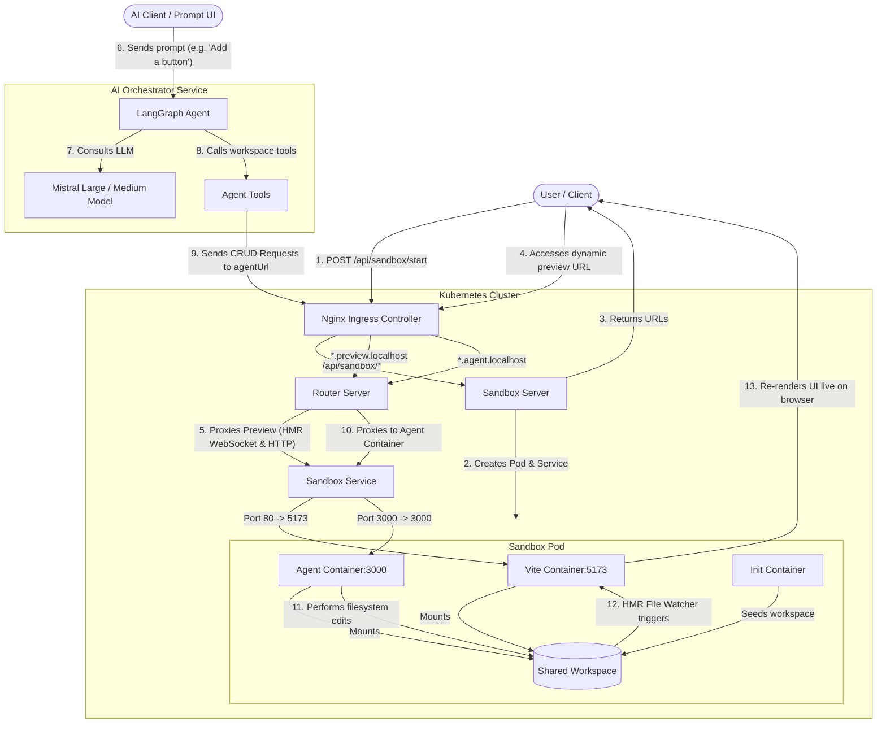

# ⚡ Capstone: Dynamic Cloud Sandbox Environments

A lightweight, cloud-native development environment engine (similar to GitHub Codespaces) that dynamically provisions containerized React+Vite workspaces on-demand in a Kubernetes cluster, served under secure subdomains with real-time Hot Module Replacement (HMR). Now supercharged with an AI-driven workspace agent for automated file editing and sandbox orchestration.

---

## 🏗️ Architecture & Component Overview

The system is composed of five core microservices and custom routing rules deployed to Kubernetes:

| Service | Path | Tech Stack | Role |
| :--- | :--- | :--- | :--- |
| **Sandbox Server** | [sandbox/server](file:///c:/Users/Rishi/Desktop/capstone/sandbox/server) | Express, K8s Client SDK | Dynamically provisions Pods and Services in Kubernetes on user demand. |
| **Router Server** | [sandbox/router](file:///c:/Users/Rishi/Desktop/capstone/sandbox/router) | Express, `http-proxy-middleware` | Inspects subdomains and dynamically proxies HTTP/WebSocket traffic to active sandboxes. |
| **Vite Template** | [sandbox/template](file:///c:/Users/Rishi/Desktop/capstone/sandbox/template) | React, Vite, TailwindCSS | The baseline workspace template running inside sandbox pods. |
| **Agent Sidecar** | [sandbox/agent](file:///c:/Users/Rishi/Desktop/capstone/sandbox/agent) | Express | A sidecar container inside the sandbox pod for workspace filesystem operations. |
| **AI Orchestrator** | [ai-orchestration](file:///c:/Users/Rishi/Desktop/capstone/ai-orchestration) | Node.js, LangGraph, Mistral AI | Run LLM coding agents using workspace file operations as executable tools. |

---

## 🔄 Architecture & Flow

This diagram illustrates how sandboxes are dynamically provisioned, how traffic is routed, and how the **AI Orchestration** loop automatically updates code in real-time:



### 📋 Steps in the Flow:
1. **Provisioning**: The client hits `POST /api/sandbox/start`. The **Sandbox Server** calls the Kubernetes API to launch a new Pod containing the Vite environment, the Agent sidecar, and a shared `/workspace` volume populated by an init-container. It also registers a corresponding cluster IP service.
2. **Dynamic URLs**: The user receives custom subdomains:
   - `http://<sandbox-id>.preview.localhost` (to view the Vite app)
   - `http://<sandbox-id>.agent.localhost` (to talk to the workspace Agent API)
3. **Ingress Entry**: The **Nginx Ingress** captures wildcard hosts (`*.preview.localhost` and `*.agent.localhost`) and routes them to the central **Router Server**.
4. **Router Proxying**: The **Router** extracts the ID and type from the request hostname and proxies all requests (HTTP and WebSockets for HMR) directly to the matched internal Sandbox Service.
5. **AI Coding Loop**: When the user requests an AI-driven edit, the **AI Orchestrator** loads a LangGraph reactive agent using the Mistral API. The agent can invoke tools in [tools.js](file:///c:/Users/Rishi/Desktop/capstone/ai-orchestration/src/agents/tools.js) to list, read, update, or create files on the workspace. These tools map to REST calls forwarded to the **Agent Sidecar**'s endpoints, writing directly to the shared workspace. The Vite watcher instantly detects edits and triggers HMR updates to the client's screen.

---

## ⚙️ Getting Started

### 📦 Prerequisites
- **Docker** & **Kubernetes** (e.g., Docker Desktop, Minikube, or Kind)
- **NGINX Ingress Controller** enabled on your local cluster
- **PowerShell** (for running the sync/build scripts)
- **Mistral API Key** (for running the AI Orchestration layer)

### 🚀 Setup Instructions

#### 1. Configure the Mistral API Key Secret
The **AI Orchestrator** reads the Mistral API key from a Kubernetes secret. Create the `ai-secret` in your cluster with your key:

```shell
kubectl create secret generic ai-secret --from-literal=MISTRAL_API_KEY="your_mistral_api_key_here"
```

#### 2. Start the Development Stack with Skaffold
The entire microservice architecture is orchestrated via Skaffold. This builds all components (orchestrator, agent, router, server, and template) and deploys them directly to your cluster, watching for live file changes:

```shell
skaffold dev
```

> [!TIP]
> Skaffold will build all images, deploy them to Kubernetes, set up the NGINX Ingress Controller routing rules, and stream all logs directly to your console.

---

## 💻 How to Use the Platform

### 1. Provision a Sandbox Environment
To dynamically spin up a new containerized React+Vite sandbox workspace alongside its Agent sidecar, send a POST request to the Sandbox Server:

```http
POST http://localhost/api/sandbox/start
Content-Type: application/json
```

**Response Example:**
```json
{
  "message": "Sandbox environment created successfully",
  "sandboxId": "019e6e23-f9d1-73a6-98c1-741a27babc65",
  "previewUrl": "http://019e6e23-f9d1-73a6-98c1-741a27babc65.preview.localhost",
  "agentUrl": "http://019e6e23-f9d1-73a6-98c1-741a27babc65.agent.localhost"
}
```

* **`previewUrl`**: Open this in your browser to see the live React + Vite app (with fully functional Hot Module Replacement!).
* **`agentUrl`**: Used by the AI Orchestration service to query and write to the sandbox's shared filesystem.

---

### 2. Invoke the Workspace AI Agent
You can instruct the LangGraph-powered AI Agent to perform complete software engineering tasks directly in the live sandbox environment.

The agent will automatically list your files, read their content, design changes, and update files using its suite of workspace CRUD tools:

```http
POST http://localhost/api/ai/agent/invoke
Content-Type: application/json

{
  "prompt": "Create a nice dark mode theme and add a toggle button to the UI"
}
```

**Response:**
```json
{
  "result": {
    "messages": [
      {
        "role": "assistant",
        "content": "I have successfully discovered the workspace structure, read the relevant components, and updated the CSS and components to add a beautiful dark-mode experience with a transition toggle. You should see the changes live on your browser!"
      }
    ]
  }
}
```

As soon as the agent completes the tool calls, Vite's live HMR updates the running browser app in less than a second!

---

## 🛠️ Workspace AI Tools

The AI Agent utilizes a custom set of LangChain-wrapped tools in [tools.js](file:///c:/Users/Rishi/Desktop/capstone/ai-orchestration/src/agents/tools.js) to interact with the environment sandbox:

* **`list-files`**: Queries the sandbox agent to return a list of all existing file paths.
* **`read-file`**: Accepts a `files` array parameter to fetch the full content of target files.
* **`update-file`**: Overwrites full content of specified files using an `updates` array parameter containing the path and full content.
* **`create-file`**: Creates brand new files using a `files` array parameter containing path and initial content.
* **`delete-file`**: Permanently deletes a file/folder at a specified path.


