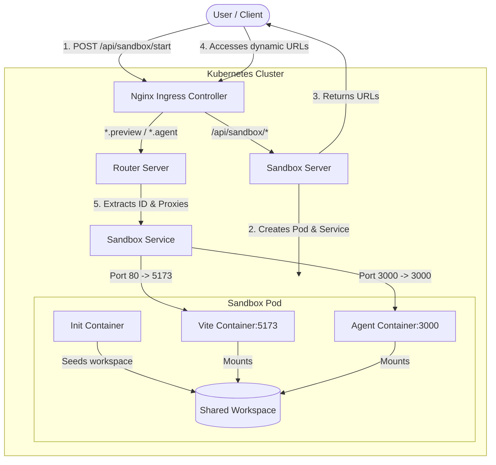

# ⚡ Capstone: Dynamic Cloud Sandbox Environments

A lightweight, cloud-native development environment engine (similar to GitHub Codespaces) that dynamically provisions containerized React+Vite workspaces on-demand in a Kubernetes cluster, served under secure subdomains with real-time Hot Module Replacement (HMR).

---

## 🏗️ Architecture & Component Overview

The system is composed of four core microservices and custom routing rules deployed to Kubernetes:

| Service | Path | Tech Stack | Role |
| :--- | :--- | :--- | :--- |
| **Sandbox Server** | [`/sandbox/server`](file:///c:/Users/Rishi/Desktop/capstone/sandbox/server) | Express, K8s Client SDK | Dynamically provisions Pods and Services in Kubernetes on user demand. |
| **Router Server** | [`/sandbox/router`](file:///c:/Users/Rishi/Desktop/capstone/sandbox/router) | Express, `http-proxy-middleware` | Inspects subdomains and dynamically proxies HTTP/WebSocket traffic to active sandboxes. |
| **Vite Template** | [`/sandbox/template`](file:///c:/Users/Rishi/Desktop/capstone/sandbox/template) | React, Vite, TailwindCSS | The baseline workspace template running inside sandbox pods. |
| **Agent Sidecar** | [`/sandbox/agent`](file:///c:/Users/Rishi/Desktop/capstone/sandbox/agent) | Express | A sidecar container inside the sandbox pod for workspace filesystem operations. |

---

## 🔄 Architecture & Flow

This diagram illustrates how sandboxes are dynamically provisioned, and how subsequent traffic (HTTP and HMR WebSockets) is routed:



### 📋 Steps in the Flow:
1. **Provisioning**: The client hits `POST /api/sandbox/start`. The **Sandbox Server** calls the Kubernetes API to launch a new Pod containing the Vite environment, the Agent sidecar, and a shared `/workspace` volume populated by an init-container. It also registers a corresponding cluster IP service.
2. **Dynamic URLs**: The user receives custom subdomains:
   - `http://<sandbox-id>.preview.localhost` (to view the Vite app)
   - `http://<sandbox-id>.agent.localhost` (to talk to the workspace Agent API)
3. **Ingress Entry**: The **Nginx Ingress** captures wildcard hosts (`*.preview.localhost` and `*.agent.localhost`) and routes them to the central **Router Server**.
4. **Router Proxying**: The **Router** extracts the ID and type from the request hostname and proxies all requests (HTTP and WebSockets for HMR) directly to the matched internal Sandbox Service.

---

## ⚙️ Getting Started

### 📦 Prerequisites
- **Docker** & **Kubernetes** (e.g., Docker Desktop, Minikube, or Kind)
- **NGINX Ingress Controller** enabled on your local cluster
- **PowerShell** (for running the sync/build scripts)

### 🚀 Setup Instructions

#### 1. Build and Load Images
First, build and load both the Vite workspace template and the agent sidecar image into your local cluster runtime.

> [!NOTE]
> Make sure your Kubernetes cluster is running before executing these scripts.

* **Build Vite Template**:
  ```powershell
  cd sandbox/template
  .\sync.ps1
  ```
* **Build Agent Sidecar**:
  ```powershell
  cd ../agent
  .\sync.ps1
  cd ../../
  ```

#### 2. Deploy Infrastructure
Apply the deployment manifests, service accounts, and routing ingress configuration:
```shell
kubectl apply -f k8s
```

#### 3. Test Sandbox Creation
Send a request to spin up a new environment:
```http
POST http://localhost/api/sandbox/start
Content-Type: application/json
```

**Response Example:**
```json
{
  "message": "Sandbox environment created successfully",
  "sandboxId": "019e640e-802c-7035-ae2a-2efed8a2d4e4",
  "previewUrl": "http://019e640e-802c-7035-ae2a-2efed8a2d4e4.preview.localhost",
  "agentUrl": "http://019e640e-802c-7035-ae2a-2efed8a2d4e4.agent.localhost"
}
```

> [!TIP]
> Use the returned `previewUrl` to view your React app running inside the Kubernetes container. Open the `agentUrl` to test filesystem operations like `/list-files`.
